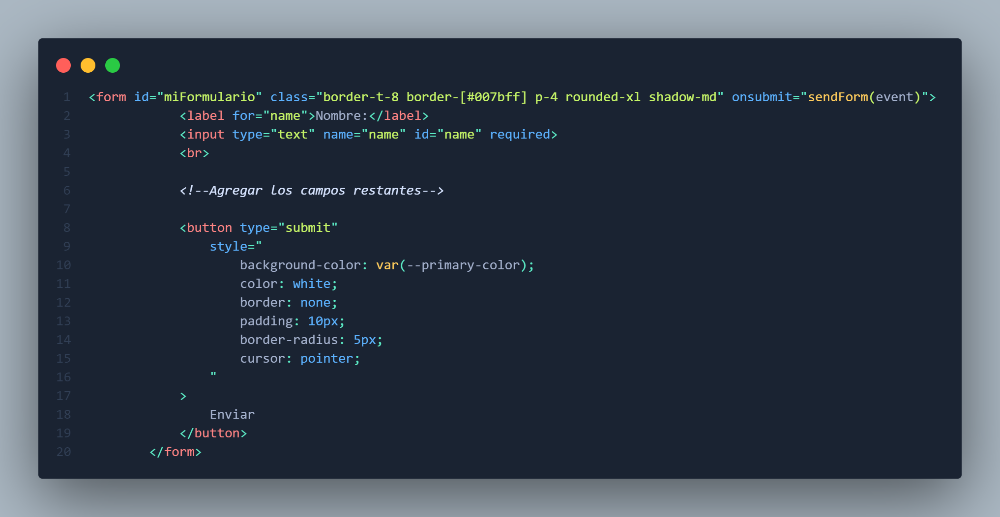

# Practica en Aula 1 - HTML CSS y JS

## Objetivo
El objetivo de esta práctica es que el alumno se familiarice con el uso de HTML, CSS y JS para la creación de páginas web.

## Ejericio 1

El ejercicio consiste en crear una página web que contenga un formulario de contacto. El formulario debe contener los siguientes campos:
- Nombre
- Apellidos
- Correo Electrónico
- Contraseña
- Confirmar Contraseña

1. Cebe enlazar el archivo de estilos `styles.css` al archivo `index.html`
2. Debe enlazar el archivo de scripts `scripts.js` al archivo `index.html`

- dado el formulario

- Complete el formulario con los campos faltantes
- Nota: no se preocupe por los estilos ya que al enlaar el archivo `styles.css` se aplicaran los estilos necesarios

- La estructura del formulario debe quedar haci:

3. Debe abrir el archivo `main.js` y completar la función `sendForm` para que al dar click en el botón enviar muestre en en la UI los datos del formulario

